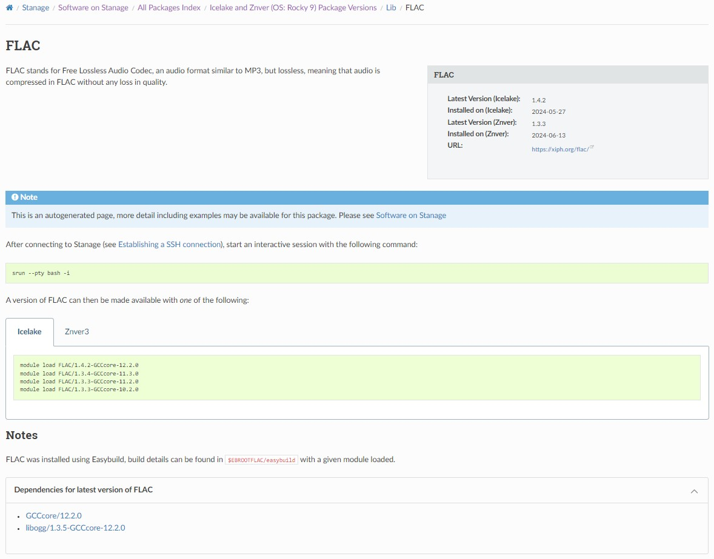
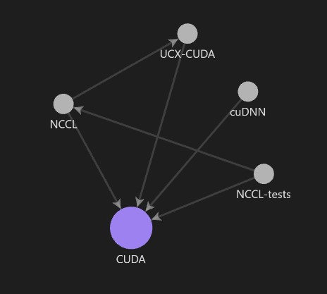

All Package Index
=================

This repository contains scripts for parsing module files, generating documentation, and syncing with the HPC documentation repository.
These scripts automate the documentation process for an "All Package Index" section of the HPC Stanage cluster documentation, including
configuration and handling dependencies for various architectures.

### TODO

- [ ] Support any number of architectures
 
## Setup and Usage

### Setting Up

```bash 
   # clone repository
   git clone https://github.com/Carldkennedy/all_package_index.git
   cd all_package_index
   # Set up local environment
   ./setup_local.sh
   # This script completes pipeline and pushes changes from a new branch to the remote repository
   ./sync_stacks.sh
```
### Configuration

To configure the necessary parameters, use config.py and config.yml:

``config.py`` defines output directories for generated documentation and other key paths. 

Output directories: Directories synced with the documentation repo:

```python
# These are paths within the documentation repository which we will sync generated docs with
stacks_dir = "results/stanage/software/stacks/"
imports_dir = "results/referenceinfo/imports/stanage/packages/"
custom_dir = "results/referenceinfo/imports/stanage/packages/custom/"
```

Module Paths and Titles: Paths for module files to parse, titles for stacks, and output directories:

```python
# Modulepaths for each architecture on each stack (this example has only one stack)  
modulepaths = {
    'icelake': "/opt/apps/tuos/el9/modules/live/all:/opt/apps/tuos/common/modules/easybuild-only/all:/opt/apps/tuos/common/modules/live/all",
    'znver3': "/opt/apps/tuos/el9-znver3/modules/live/all:/opt/apps/tuos/common/modules/easybuild-only/all:/opt/apps/tuos/common/modules/live/all"
}
# Titles for pages related to each stack
titles = [
    "Icelake and Znver (OS: Rocky 9) Packages"
]
# This will construct the path (appending to $stacks_dir) for the main package files for each stack
output_dirs = [
    "el9-icelake-znver-stanage"
]
```

In this example, the directories which the category directories and package files will be stored:

``/stanage/software/stacks/el9-icelake-znver-stanage/{All,Bio,Cae,Chem,etc}``

The title of the stack is 'Icelake and Znver (OS: Rocky 9) Packages'.

The module files which are located in modulepaths are parsed, in this case one set for each architecture.

``config.yml`` includes [HPC-Rocket](https://github.com/SvenMarcus/hpc-rocket/ "https://github.com/SvenMarcus/hpc-rocket/") configuration for starting a batch job on cluster.


### Scripts Overview

The repository includes several scripts and modules organised under mods2docs, each with a specific role in the pipeline:

    |____ README
    |____ run-hpc-rocket.sh    initiates slurm job on cluster
    |____ setup_local.sh       activates required environment, generating it if doesn't exist
    |____ slurm.sh             job script run collect_data.py on hpc cluster
    |____ sync_stacks.sh       syncs *rst files into hpc docs repo
    |____ mods2docs
    | |____ config.py          configuration file
    | |____ config.yml         configuration for hpc-rocket
    | |____ collect_data.py    parses module files in modulepaths for each arch
    | |____ utils.py           commonly used functions
    | |____ start_pipeline.py  produces *.rst files, running collect_data.py if not already run today
    | |____ writer
    | | |____ common.py        commonly used writer functions
    | | |____ obsidian.py      creates markdown files for force directed graph in Obsidian
    | | |____ rest.py          produces *.rst files for sphinx documentation
    | |____ parser
    | | |____ common.py
    | | |____ lmod.py          parses lua module files on modulepath

## mods2docs 
mods2ocs is a tool designed to automate the process of generating structured documentation from modular data or 
configuration files. It collects and processes information from various modules, configuration files, or source code,
and outputs it in a standardised documentation format (such as Markdown, HTML, or other formats). 
This is especially useful in environments where documentation needs to be kept up-to-date with frequent configuration
or code changes, as mods2docs extracts information directly from the source and formats it into easy-to-read documents.

The primary script, start_pipeline.py, orchestrates the data parsing and documentation generation pipeline.
This example usess the lmod parser and ReST writer to generate documentation:

```python
python -m mods2docs.start_pipeline --parser lmod --writer rest.py
```

### Writer modules

``mods2docs.writer.rest``

``mods2docs.writer.obsidian`` 

Below are some of the functions in ``mods2docs.writer.rest``, which we may wish to customise:

```python
# Processes data parsed from modulepaths 
process_modulepath(modulepaths, title, output_dir)
# which is then passed to the write_package_file 
write_package_file(category_dir, category, package, output_dir)
# all the following functions write files which are imported into the package file
write_sidebar_file(package, category, latest_version_info, output_dir)
write_description_file(package, latest_info, output_dir)
write_installation_file(package, latest_info, output_dir)
write_custom_file(package, output_dir)
write_dependencies(dependencies, output_dir, category, package, package_ref)
write_ml_file(package, package_infos, output_dir)
```

We recommend copying ``mods2docs/writer/rest.py`` to for example ``mods2docs/writer/rest-shef.py``
Edit as required then you can use this module for writing your documentation.

```python
python -m mods2docs.start_pipeline --parser lmod --writer rest-shef.py
```

The generated files for each package found on the given module paths includes:

* Description
* Sidebar - Latest version available on each architecture, date module file was last modified, and URL.
* Versions available - as module load commands in grouped tabs (for each architecture).
* Notes - detailing how to view build logs, etc.
* Dependencies - Shows the dependencies for the latest version (across architectures), each is a link to it's respective page.

Each of the above is imported into a package's page when built, this allows re-use of these imports
elsewhere in the documentation. 

```bash
# A list of files generated in imports_dir for CUDA
$ls referenceinfo/imports/stanage/packages/cuda-*
cuda-dpnd-el9-icelake-znver-stanage.rst
cuda-dscr-el9-icelake-znver-stanage.rst
cuda-inst-el9-icelake-znver-stanage.rst
cuda-ml-el9-icelake-znver-stanage.rst
cuda-sdbr-el9-icelake-znver-stanage.rst
```

An example of built output is available [here](https://carldkennedy.github.io/all_package_index/stanage/software/stubs/index.html)



The ``mods2docs.writer.obsidian`` module will output markdown files into a directory which we can open with [Obsidian](https://obsidian.md/) 
to leverage it's built-in force-directed-graph functionality to visualise the relationships between the latest versions of all packages.
We can use the global graph to see all connections between packages or a local graph to focus on specific packages and their immediate connections. 

```python
python -m mods2docs.start_pipeline --parser lmod --writer obsidian
```
Local graph example for CUDA:




### Parser Modules

``mods2docs.parser.lmod`` 

There is currently one parser module ``mods2docs.parser.lmod`` which utilises LuaRuntime to extract all information 
from module files, and stores data in a pickle.

## Contributing

We welcome contributions to the All Package Index project! Whether you’d like to report a bug, suggest new features,
or improve the documentation, your help is invaluable to the project’s success. 
Please follow the guidelines below to ensure a smooth collaboration process.

1. Start by [forking](https://docs.github.com/en/pull-requests/collaborating-with-pull-requests/working-with-forks/fork-a-repo "Fork a repository") this repository to create a personal copy under your GitHub account.
2. Clone the forked repository to your local machine for development.
```
git clone https://github.com/your-username/all-package-index.git
```
3. Create a new branch to isolate your changes.
```
git checkout -b feature/your-feature-name
```
4. Develop and test your changes locally.

5. Commit your work with clear, descriptive commit messages.
```
git commit -m "Add feature or fix: brief description"
```
6. Push to Your Fork: Push your branch to your fork on GitHub.
```
git push origin feature/your-feature-name
```
7. Go to the original repository on GitHub, select "Pull Requests," and 
[open a new pull request](https://docs.github.com/en/pull-requests/collaborating-with-pull-requests/proposing-changes-to-your-work-with-pull-requests/about-pull-requests "About Pull Requests").
Describe your changes and why they should be merged.

#### Guidelines
 - Keep It Focused: Ensure each pull request addresses a single issue or feature.
 - Stay in Sync: Regularly sync your fork with the original repository to prevent merge conflicts.
 - Document Changes: Update the README or relevant documentation sections as necessary.
 - Thank you for your contribution! We appreciate your efforts to help improve the project.